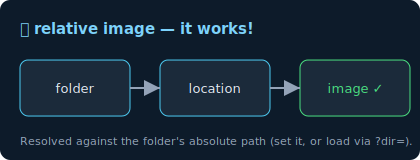

# Kitchen Sink — every Markdown construct

The block above is **YAML frontmatter** — it should render as a small properties
table, not raw `---` text.

This file is original test content for **🐦 SeaGull MD Viewer**. It deliberately
exercises every feature the renderer supports, so you can eyeball the styling of
each theme and font against one document.

<a id="top"></a>

## Contents

Click any link below — each should jump to its section. This TOC **deliberately
mixes anchor conventions** so you can verify in-page navigation works in every
browser, no matter how the link was authored:

- [Headings](#headings) — lowercase slug
- [Text emphasis](#text-emphasis) — lowercase slug
- [Lists](#lists) — lowercase slug
- [Blockquotes](#Blockquotes) — Capitalized (raw heading text)
- [Code](#Code) — Capitalized
- [Tables](#Tables) — Capitalized
- [Inline HTML](#Inline%20HTML) — `%20`-encoded spaces
- [Images](#Images) — Capitalized
- [Escaping & special characters](#Escaping%20%26%20special%20characters) — encoded `&` + spaces
- [Callouts](#callouts) — Obsidian
- [Wikilinks](#wikilinks) — Obsidian
- [Highlight & comment](#highlight-comment) — Obsidian
- [Footnotes](#footnotes) — Obsidian
- [Custom task states](#custom-task-states) — Obsidian
- [A longer passage](#a-longer-passage-for-scrolling-line-length) — slug, jumps to the bottom

> Every link above points at a *different spelling* of its heading (slug vs.
> Capitalized vs. `%20` vs. encoded punctuation), yet all should land on the
> correct section. If one doesn't scroll, that's a real bug to report.

---

## Headings

# H1 heading
## H2 heading
### H3 heading
#### H4 heading

## Text emphasis

Normal, **bold**, *italic*, ***bold italic***, ~~strikethrough~~, and `inline code`.
A line with a hard break at the end,  
so this sits on the next line.

Here is a paragraph with a [normal inline link](https://example.com), a
[link with a title](https://example.com "hover me"), an autolink
<https://example.com>, and a [reference-style link][ref] defined below.

[ref]: https://example.com "Reference link target"

## Lists

Unordered, nested:

- First item
- Second item
  - Nested item
  - Another nested item
    - Third level
- Third item

Ordered, nested:

1. Step one
2. Step two
   1. Sub-step a
   2. Sub-step b
3. Step three

Task list:

- [x] Implement themes
- [x] Implement reading fonts
- [ ] Conquer the seven seas
- [ ] Teach the seagull to type

## Blockquotes

> A single-line quote.

> A multi-paragraph quote.
>
> With a second paragraph, some **bold**, and a nested quote:
>
> > Nested blockquote, going deeper.
> >
> > - even a list inside the nested quote

## Code

Inline: use `marked.parse(md)` to render.

Fenced, JavaScript:

```js
function greet(name) {
  // a comment
  return `Hello, ${name}!`;
}
console.log(greet("world"));
```

Fenced, Python:

```python
def fib(n):
    a, b = 0, 1
    for _ in range(n):
        a, b = b, a + b
    return a
```

Fenced, no language (plain):

```
$ seagull --open ~/recipes
loaded 248 files
```

## Tables

| Feature        | Status | Notes                          |
|:---------------|:------:|-------------------------------:|
| Folder tree    |   ✅   | drag a folder in              |
| Favorites      |   ✅   | star the open file            |
| Themes         |   ✅   | Midnight / Paper / Dark / Sepia |
| Fonts          |   ✅   | System / Serif / Book / …      |
| World peace    |   🚧   | tracked in a future release   |

(Columns above are left / center / right aligned.)

[↑ Back to top](#top)

## Horizontal rule

Above the line.

---

Below the line.

## Inline HTML

This paragraph contains <strong>inline HTML strong</strong> and
<code>inline HTML code</code>, which the renderer should pass through.

<details>
<summary>Click to expand a details block</summary>

Hidden content lives here — a paragraph and a list:

- one
- two

</details>

## Images

A relative image — `assets/diagram.svg` — renders once the folder's absolute
location is known (set the **folder location** field above the tree, or load the
folder via `?dir=`):



A broken/remote image (tests graceful failure):


## Callouts

Obsidian-style callouts (styled boxes; `-` makes one collapsible):

> [!note] A note callout
> Body text, with **bold** and a nested list:
> - one
> - two

> [!warning] Heads up
> Warnings get a distinct accent colour.

> [!tip]- Collapsible tip (starts folded)
> Hidden until you click the title.

## Wikilinks

These resolve against the loaded folder (open this file via the `sample-vault`
folder so the links have targets):

- [[guides/getting-started]] — link by path
- [[reference/tables-and-data]] — another note
- [[obsidian-features]] — the dedicated Obsidian demo
- [[reference/code-and-tasks#Several languages|see the code samples]] — heading link + alias
- [[does-not-exist]] — broken link (clicking says "note not found")

## Highlight & comment

Here is ==highlighted text== inline. %%this comment is hidden in preview%% Done.

## Footnotes

A claim that needs a citation[^1], and a named one[^kbase].

[^1]: First footnote definition.
[^kbase]: Named footnotes are supported too.

## Custom task states

- [x] standard done (GFM)
- [ ] standard todo (GFM)
- [/] partial
- [-] cancelled
- [>] forwarded
- [?] question

[↑ Back to top](#top)

## Escaping & special characters

Escaped: \*not italic\*, \`not code\`, \# not a heading.
Symbols: © ® ™ → ⇒ ★ ☆ — – … « » ¶ § µ ✓ ✗
Emoji: 🐦 🌊 📄 📁 🔖 ✨

## A longer passage (for scrolling / line-length)

Lorem ipsum dolor sit amet, consectetur adipiscing elit, sed do eiusmod tempor
incididunt ut labore et dolore magna aliqua. Ut enim ad minim veniam, quis
nostrud exercitation ullamco laboris nisi ut aliquip ex ea commodo consequat.
Duis aute irure dolor in reprehenderit in voluptate velit esse cillum dolore eu
fugiat nulla pariatur. Excepteur sint occaecat cupidatat non proident, sunt in
culpa qui officia deserunt mollit anim id est laborum.

Sed ut perspiciatis unde omnis iste natus error sit voluptatem accusantium
doloremque laudantium, totam rem aperiam, eaque ipsa quae ab illo inventore
veritatis et quasi architecto beatae vitae dicta sunt explicabo.

[↑ Back to top](#top)

— end of kitchen sink —
